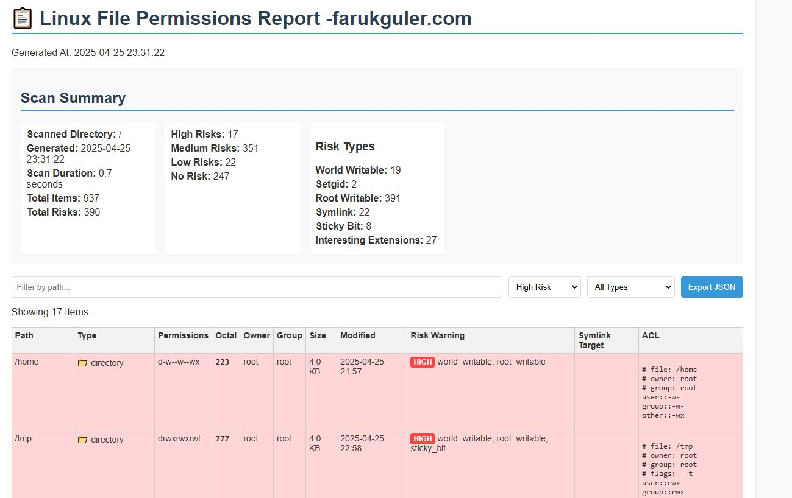

# Linux ACL Reporter v1.3 - farukguler.com

A high-performance security auditing tool for Linux file permissions and Access Control Lists (ACLs).



## 🚀 Key Features

- **Professional UI**: Interactive HTML report matching the original `report.jpeg` design.
- **Configurable Pagination**: Handle massive file systems (16k+ items) without browser freezing.
- **Enhanced Security Risks**: Automatically flags world-writable files, sensitive exposures (SSH keys, history), and unusual SUID/SGID bits.
- **Flexible Configuration**: Manage scan paths, excludes, and rules via `config.toml`.
- **English Localization**: Clean, professional logs and reports.
- **ACL Support**: Automated startup check for `getfacl` dependency.

## 🛠️ Installation & Requirements

- **Python 3.11+** (uses `tomllib`) or `pip install tomli` for older versions.
- **ACL Package**: Required for detailed ACL scanning.
  ```bash
  sudo apt install acl  # Debian/Ubuntu
  sudo yum install acl  # RHEL/CentOS
  ```

## 📖 Usage

1. **Configure**: Update `config.toml` with your target path and rules.
   ```toml
   [scan_settings]
   target_path = "/"
   depth = 5
   
   [output_settings]
   report_pagination = 1000
   ```
2. **Scan**:
   ```bash
   python analyzer.py /target/directory
   ```
3. **Analyze**: Open `permission_report.html` in your browser.

## 📝 Developer Information

- **User**: faruk-guler
- **Website**: [www.farukguler.com](http://www.farukguler.com)
- **GitHub**: [github.com/faruk-guler](https://github.com/faruk-guler)

## License
Apache 2.0 License - Developed with focus on Linux security auditing.
